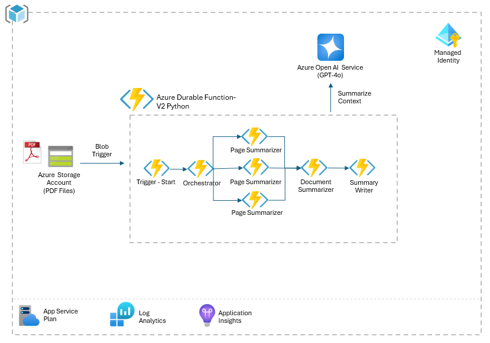

> [!WARNING]  
> **This project is currently in active development and may contain breaking changes.**  
> Updates and modifications are being made frequently, which may impact stability or functionality. This notice will be removed once development is complete and the project reaches a stable release.


# Large Document Summarization with Azure OpenAI GPT-4o and Durable Functions


This repository showcases how to use Azure Durable Functions with the [**Fan-out/Fan-in**](https://learn.microsoft.com/en-us/azure/azure-functions/durable/durable-functions-overview?tabs=in-process%2Cnodejs-v3%2Cv1-model&pivots=csharp#fan-in-out) pattern to efficiently process and summarize large documents. By breaking down the workload into smaller, manageable tasks and combining the results, this approach creates a cohesive summary of the entire document.

## Workflow Overview

 

### 1. Triggering the Workflow
- The process begins when a trigger event occurs, such as uploading a PDF to **Azure Blob Storage**.
- This event activates the **Azure Function orchestrator**, initiating the summarization process.

### 2. Fan-out Phase
- The orchestrator divides the document into smaller sections (e.g., individual pages or logical segments).
- Each section is sent to **Azure OpenAI Service**, where summaries for individual pages or sections are generated.

### 3. Fan-in Phase
- The individual summaries are aggregated and sent back to **Azure OpenAI Service**.
- Azure OpenAI generates a cohesive, final summary for the entire document.

## Benefits
- **Scalability:** Processes large documents in parallel for faster execution.
- **Efficiency:** Leverages Azure's serverless ecosystem for seamless orchestration.
- **Flexibility:** Easily integrates with Azure Blob Storage and Azure OpenAI for dynamic workloads.

Explore the repository to learn more about setting up Durable Functions and optimizing the summarization workflow.

 
## Requirements
- Azure subscription for deploying Azure GenAI RAG Application.
- [Azure CLI](https://learn.microsoft.com/en-us/cli/azure/get-started-with-azure-cli) (Command Line Interface)
- Python 3.11.4 installed on development environment.
- An IDE for Development, such as [VS Code](https://code.visualstudio.com/download)


## Usage

Follow these steps to set up and deploy the solution:

### 1. Clone the Repository from GitHub:  
Begin by cloning the repository to your local machine using the following command:

```bash
git clone https://github.com/jonathanscholtes/Azure-AI-Large-Document-Summarization.git
cd Azure-AI-Large-Document-Summarization
```

### 2. Deploy the Solution Using Bicep:  
Navigate to the deployment directory:

```bash
cd infra
```

Then, use the following PowerShell command to deploy the solution. Make sure to replace the placeholders with your actual subscription name, Azure Region (location)

**PowerShell**
```bash
.\deploy.ps1 -Subscription '[Subscription Name]' -Location 'southcentralus'
```

This script will provision the necessary resources in your Azure subscription according to the specified parameters. The deployment may take upto **10 minutes** to provision all Azure resources.


## Clean-Up

After completing testing, ensure to delete any unused Azure resources or remove the entire Resource Group to avoid incurring additional charges.

### Resource Purge for Redeployment

If you plan to delete and redeploy this solution, you may need to manually purge **Azure OpenAI**.

#### Azure OpenAI Purge

To permanently delete an Azure OpenAI or other Azure AI service, follow [these steps](https://learn.microsoft.com/en-us/azure/ai-services/recover-purge-resources?tabs=azure-portal#purge-a-deleted-resource):

1. **Navigate to the Azure AI Service Hub**:  
   Go to the hub of the Azure AI service associated with the deleted resource. For instance, if you need to purge an "Anomaly Detector" resource, search for "Anomaly Detector" in the Azure portal search bar, select the service, and then choose **Manage Deleted Resources** from the menu.

2. **Select the Subscription and Deleted Resource**:  
   In the **Manage Deleted Resources** section, choose the relevant subscription from the dropdown list, then locate and select the deleted resource(s) you wish to purge.

3. **Purge the Resource**:  
   Click **Purge** to permanently delete the selected resource(s). Be aware that purging is irreversible and removes all associated configurations and data for the resource.


## License
This project is licensed under the [MIT License](MIT.md), granting permission for commercial and non-commercial use with proper attribution.